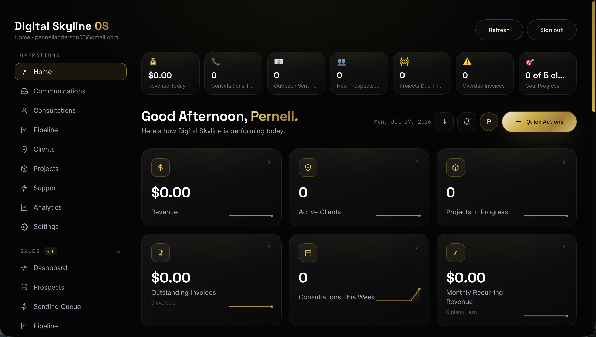
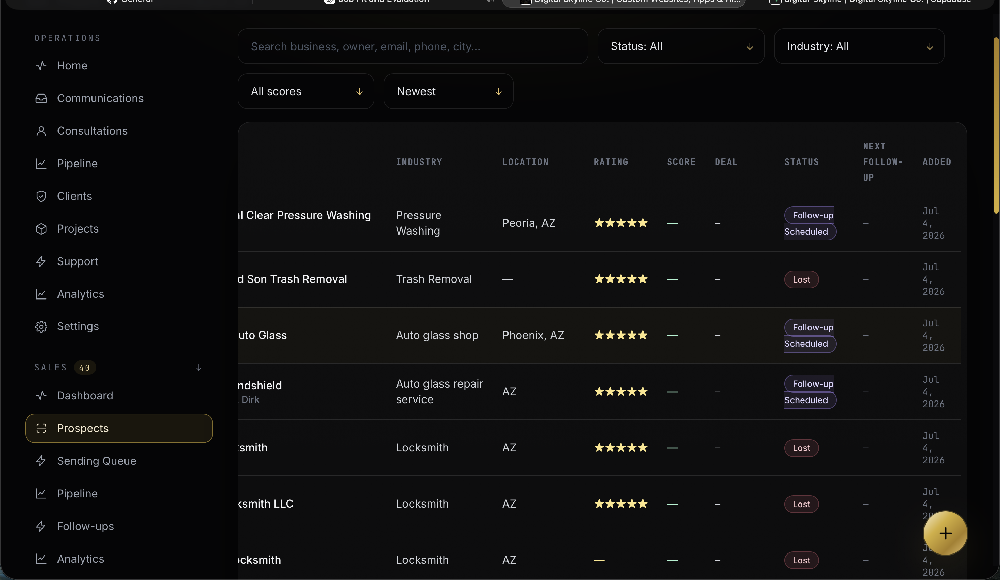
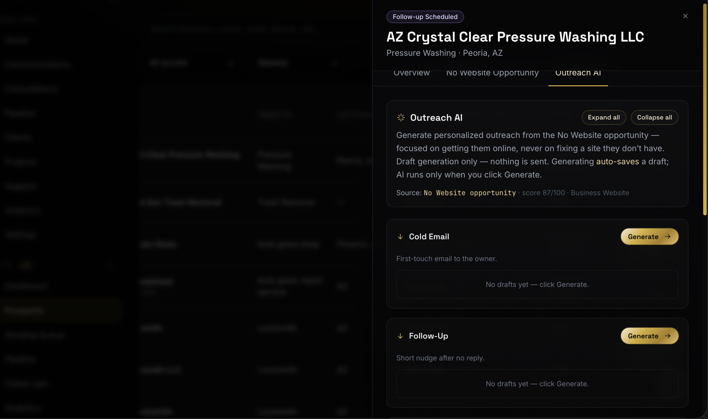
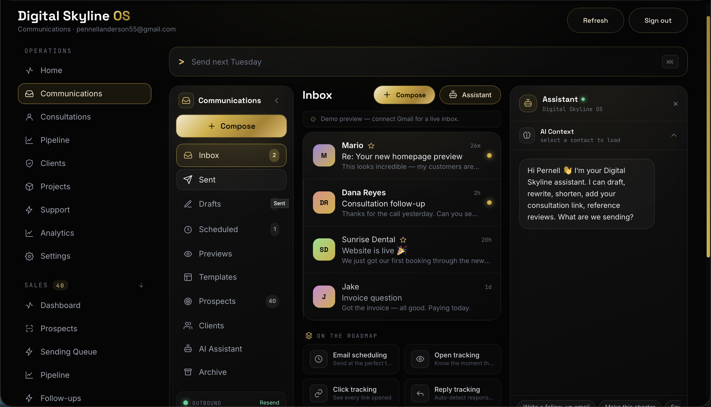

# Digital Skyline

> **AI-Powered Business Operations Platform**


Digital Skyline is a full-stack business operations platform designed to help service-based businesses manage leads, automate outreach, analyze websites, communicate with clients, schedule consultations, and securely process payments—all from one centralized dashboard.

Originally developed as a modern agency website, the platform has evolved into a production-ready application demonstrating full-stack software engineering, cloud deployment, database architecture, AI integration, and business automation.

---

# Live Application

🌐 **Website:** https://www.digitalskylineco.com

---

# Features

## Public Website

- Responsive landing pages
- Service showcase
- Portfolio gallery
- Pricing plans
- FAQ section
- Contact forms
- Consultation booking
- Mobile-first design
- SEO optimization

---

## Customer Relationship Management (CRM)

- Lead management
- Client management
- Business profiles
- Contact information
- Status tracking
- Notes
- Follow-up reminders
- Duplicate detection

---

## AI Website Intelligence

Automatically evaluates business websites and generates actionable recommendations.

Analysis includes:

- Mobile responsiveness
- Search engine optimization
- HTTPS security
- Booking functionality
- Testimonials
- Frequently asked questions
- Performance observations
- User experience improvements

---

## AI Outreach

Generate personalized outreach content for potential clients.

Features include:

- Personalized email generation
- AI-generated talking points
- Follow-up suggestions
- Business summaries
- Outreach history

---

## Communications Center

Manage business communication from one dashboard.

Supports:

- Branded email sending
- Photo attachments
- Video attachments
- Secure call-to-action buttons
- AI-assisted email writing

---

## Consultation Management

- Calendar scheduling
- Appointment requests
- Time-slot selection
- Business information collection
- Consultation workflow

---

## Payments

Integrated Stripe payment processing.

Includes:

- Secure payment links
- Revenue tracking
- Payment status
- Client payments
- Webhook support

---

# Technology Stack

## Frontend

- React
- JavaScript
- Vite
- Tailwind CSS
- HTML5
- CSS3

## Backend

- Supabase
- PostgreSQL
- Authentication
- Row Level Security
- Serverless Functions

## APIs & Integrations

- Stripe
- Anthropic API
- Resend
- Vercel

## Development Tools

- Git
- GitHub
- Visual Studio Code
- Claude Code
- ChatGPT

---

# Project Structure

```text
digital-skyline/

├── api/
├── public/
├── scripts/
├── src/
│   ├── components/
│   ├── pages/
│   ├── hooks/
│   ├── services/
│   ├── utils/
│   └── assets/
│
├── supabase/
├── package.json
├── vite.config.js
├── tailwind.config.js
├── vercel.json
├── .env.example
└── README.md
```

---

# Screenshots

### Homepage


### Admin Dashboard



### CRM



### Website Intelligence


### AI Outreach



### Communications Center



### Consultation Booking

(Add screenshot)

### Revenue Dashboard

(Add screenshot)

---

# Running Locally

Clone the repository

```bash
git clone https://github.com/YOUR_USERNAME/digital-skyline.git
```

Move into the project

```bash
cd digital-skyline
```

Install dependencies

```bash
npm install
```

Create your environment file

```bash
cp .env.example .env.local
```

Add your environment variables.

Start the development server.

```bash
npm run dev
```

---

# Environment Variables

Sensitive credentials are stored using environment variables.

Example values are provided in:

```text
.env.example
```

No production credentials are committed to this repository.

---

# Engineering Highlights

This project demonstrates experience with:

- Full Stack Development
- React Architecture
- Database Design
- REST APIs
- Authentication
- Payment Processing
- Email Automation
- AI Integration
- Cloud Deployment
- Responsive UI Design
- Performance Optimization
- Git Workflow
- Production Debugging

---

# Roadmap

Future improvements include:

- Advanced analytics
- Team collaboration
- Role-based permissions
- Workflow automation
- AI recommendations
- Reporting dashboard
- Client portal
- Expanded CRM capabilities

---

# Developer

## Pernell Anderson

Full Stack Developer focused on building scalable web applications, AI-powered business software, and automation platforms.

### Connect

Portfolio  
Coming Soon...

GitHub  
https://github.com/pennellanderson55-collab/digital-skyline-website

LinkedIn  
https://www.linkedin.com/in/pennell-anderson-a407473b3/?skipRedirect=true

Email  
hello@digitalskylineco.com

---

# License

This project is licensed for portfolio and educational purposes.
